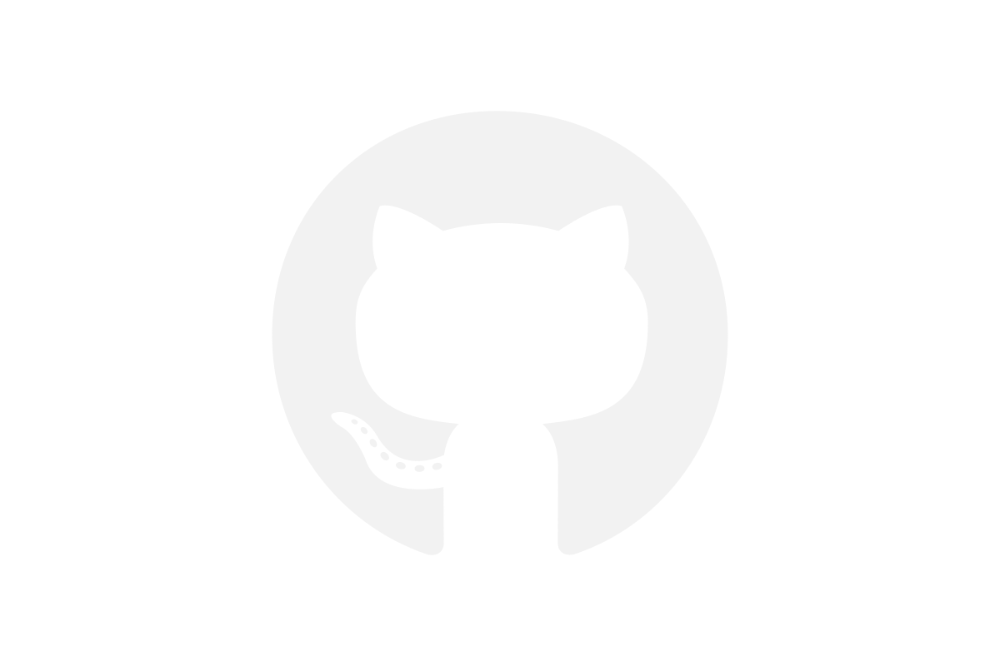

# Bienvenue sur mon GitHub

## Qui suis-je ? 

Après dix ans de métier dans le Travail Social, surtout en protection de l'enfance et dans l'accompagnement des victimes de violences ou maltraitances, j'ai souhaité me reconvertir.

Je suis aujourd'hui titulaire du titre RNCP Niveau 5 <b>Développeur web et web Mobile</b>.

Je travaille en local sur des petits projets pour me perfectionner et m'autoformer sur différentes technologies.

Étant moi-même malvoyant, je suis très attaché à l'UX Design sourtout concernant l'accessibilité web et mobile. J'effectue moi-même les tests sur ma machine, mon smartphone.
## Mes stacks

 

 

 

## Mon softs

## Mes stats

